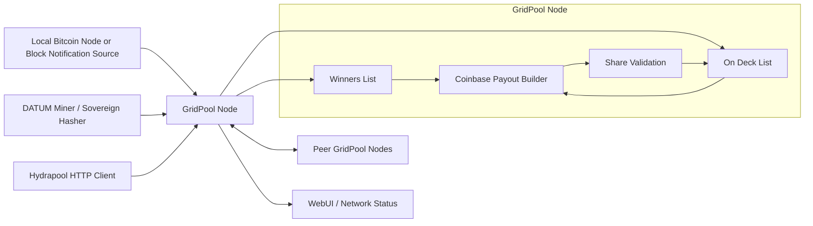
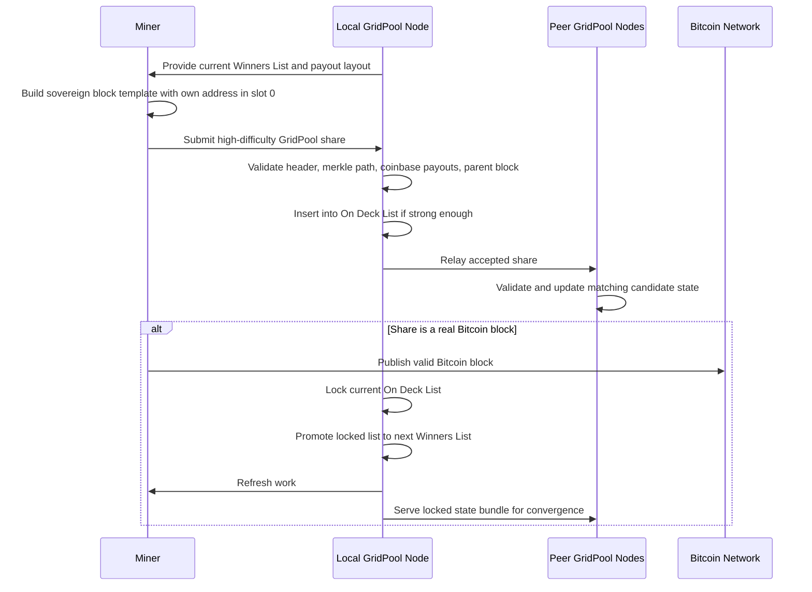

# GridPool protocol Architecture and Launch Model

## Summary
GridPool protocol is a decentralized reward-sharing protocol for sovereign Bitcoin miners. It is designed to reduce payout variance without centralizing block construction or pooling block rewards into a custodial wallet.

Each miner continues to build and hash their own Bitcoin block templates. The only shared coordination is a rotating Winners List of payout addresses derived from previously submitted high-difficulty shares. Slot `0` is always reserved for the current miner's own payout address and receives transaction fees. The remaining `299` shared slots are filled by the current Winners List.

This creates a system that is simpler than historical share-chain designs, compatible with sovereign template construction, and aligned with the goals of censorship resistance and decentralization.

## High-Level Design

## Core Protocol Flow

## Main Components

- `DATUM integration`: miners receive GridPool-compatible payout instructions while retaining sovereign template construction.
- `HTTP API`: used for compatible external integrations such as Hydrapool-style share submission and state queries.
- `Peer sync layer`: GridPool nodes exchange state summaries, locked state bundles, and accepted shares.
- `Canonical verifier`: validates submitted shares by checking header difficulty, coinbase payout rules, merkle root consistency, and accepted parent-block ancestry.
- `State service`: maintains the current Winners List, current On Deck List, archived round bundles, peer status, and deterministic testing state.
- `WebUI and health endpoints`: expose operator-facing status, peers, list state, and diagnostic information.

## Security and Design Properties

- `No central reward wallet`: rewards are paid directly through the found block's coinbase.
- `Sovereign block construction`: miners build their own templates rather than relying on a central pool template server.
- `Reduced variance`: at full configuration, the protocol is designed to provide up to 300x lower variance than pure solo mining.
- `Share-stealing resistance`: GridPool shares are credited to the miner's slot `0` address, which is committed through the merkle root.
- `Block withholding resistance`: a miner who finds a valid block has a direct incentive to publish it immediately because slot `0` pays them directly.
- `Low overhead`: node coordination is lightweight relative to share-chain designs.

## Current Launch Shape

- `Shared slots`: `299`
- `Total payout slots per template`: `300`
- `Slot 0`: miner's own payout address, receives remaining finder allocation and transaction fees
- `Shared slots 1-299`: Winners List entries derived from accepted GridPool shares

If there are fewer than `299` populated shared Winners List entries, the subsidy is divided among the active participants in the current round rather than forcing empty slots.

## Genesis Launch Model

The network can be launched with a simple genesis Winners List:

- the 256 Foundation donation address occupies the initial shared Winners List
- participating miners begin hashing GridPool-compatible templates
- when the first valid GridPool block is mined, the protocol launches into normal rotating Winners List behavior

In that launch configuration, the first GridPool-valid block would direct roughly half the subsidy to the Foundation's genesis address, with the remaining finder allocation and fees going to the miner who finds and publishes the block.

## What Is Already Implemented

- DATUM-based GridPool mining flow
- peer discovery and peer polling
- share relay between GridPool nodes
- current-state and candidate-state synchronization
- Docker packaging and Linux service deployment
- WebUI, health endpoints, and operator diagnostics
- request guards and rate limiting
- deterministic mainnet-shadow testing trigger for round rotation

## Remaining Work Before Public Launch

- broader multi-node testing and bug hardening
- final operator documentation and launch runbooks
- improved privacy characteristics and deployment guidance
- production seed-node deployment and monitoring
- Hydrapool upstream integration completion
- longer-term on-chain state commitment support when miner template hooks permit it
