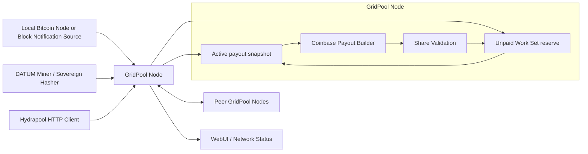
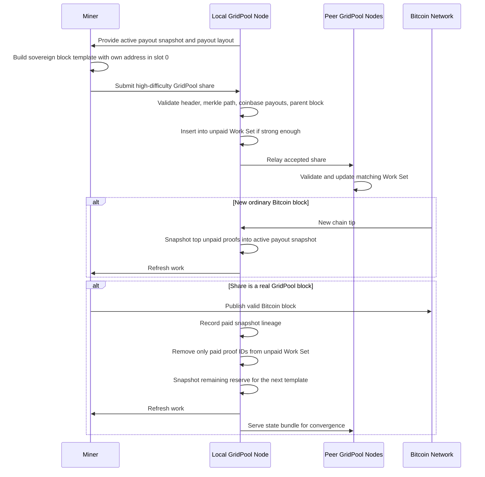

# GridPool Architecture and Launch Model

## Summary
GridPool is a decentralized reward-sharing protocol for sovereign Bitcoin miners. It is designed to reduce payout variance without centralizing block construction or pooling block rewards into a custodial wallet.

Each miner continues to build and hash their own Bitcoin block templates. The only shared coordination is an active payout snapshot derived from a bounded unpaid Work Set of previously submitted high-difficulty shares. Slot `0` is always reserved for the current miner's own payout address and receives transaction fees plus any subsidy remainder. With the default support fee enabled, one post-slot-0 slot is the canonical Grid Labs support output and up to `298` shared proof slots are paid. If the support slot is disabled, up to `299` shared proof slots are paid.

This creates a system that is simpler than historical share-chain designs, compatible with sovereign template construction, and aligned with the goals of censorship resistance and decentralization.

## High-Level Design

## Core Protocol Flow

## Main Components

- `DATUM integration`: miners receive GridPool-compatible payout instructions while retaining sovereign template construction.
- `HTTP API`: used for compatible external integrations such as Hydrapool-style share submission and state queries.
- `Peer sync layer`: GridPool nodes exchange state summaries, locked state bundles, and accepted shares.
- `Canonical verifier`: validates submitted shares by checking header difficulty, coinbase payout rules, merkle root consistency, and accepted parent-block ancestry.
- `State service`: maintains the active payout snapshot, unpaid Work Set reserve, paid snapshot lineage, archived state bundles, peer status, and deterministic testing state.
- `WebUI and health endpoints`: expose operator-facing status, peers, list state, and diagnostic information.

## Security and Design Properties

- `No central reward wallet`: rewards are paid directly through the found block's coinbase.
- `Sovereign block construction`: miners build their own templates rather than relying on a central pool template server.
- `Reduced variance`: at full configuration, the protocol is designed to provide up to 300x lower variance than pure solo mining.
- `Share-stealing resistance`: GridPool shares are credited to the miner's slot `0` address, which is committed through the merkle root.
- `Block withholding resistance`: a miner who finds a valid block has a direct incentive to publish it immediately because slot `0` pays them directly.
- `Low overhead`: node coordination is lightweight relative to share-chain designs.

## Current Launch Shape

- `Total conceptual payout slots per template`: `300`
- `Slot 0`: miner's own payout address, receives one slot's subsidy value plus any subsidy remainder and transaction fees
- `Support slot`: enabled by default; one canonical Grid Labs support output worth `subsidy / 300`
- `Shared proof slots`: up to `298` with support enabled, or up to `299` with support disabled
- `Unpaid Work Set reserve`: default `3 * 299 = 897` proofs

Slot payouts use a fixed value of `subsidy / 300`. If there are fewer populated shared proof slots, the unassigned subsidy remains with slot `0` rather than being redistributed across existing shared entries.

## Snapshot/Reserve Launch Model

The network no longer depends on a special first block that pays a donation-only genesis Winners List.

- every observed Bitcoin block snapshots the highest-ranked unpaid proofs into the active payout template
- this snapshot step does not remove proofs from the unpaid Work Set
- when the first valid GridPool block is mined, it pays the active snapshot directly from the coinbase
- only the proof IDs in the paid snapshot are removed from the Work Set
- reserve proofs that were not paid remain eligible for the next snapshot

This lets the first paid GridPool block reflect the work that miners actually contributed during launch, while still preserving the slot-0 finder incentive.

## What Is Already Implemented

- DATUM-based GridPool mining flow
- peer discovery and peer polling
- share relay between GridPool nodes
- current-state and candidate-state synchronization
- Docker packaging and Linux service deployment
- WebUI, health endpoints, and operator diagnostics
- request guards and rate limiting
- deterministic mainnet-shadow testing markers and snapshot behavior

## Remaining Work Before Public Launch

- broader multi-node testing and bug hardening
- final operator documentation and launch runbooks
- improved privacy characteristics and deployment guidance
- production seed-node deployment and monitoring
- Hydrapool upstream integration completion
- longer-term on-chain state commitment support when miner template hooks permit it
